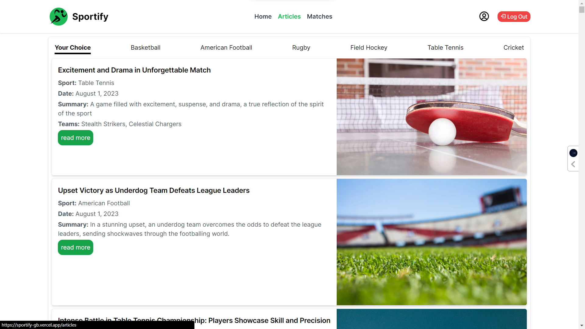
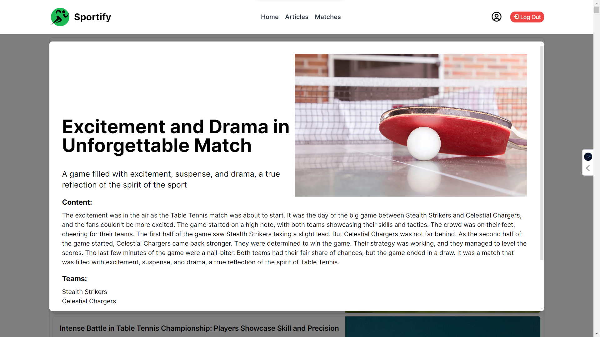

# Sportify

Sportify is a Sports News and Scores Dashboard web application developed as a capstone project for the Pupilfirst WD301 course. It allows users to browse sports news, filter articles by sport, view live scores and match details, and personalize their dashboard preferences.

## Table of Contents

- [Features](#features)
- [User Interface Requirements](#user-interface-requirements)
- [Optional Features](#optional-features)
- [Installation](#installation)
- [Usage](#usage)
- [Output](#output)
- [Contributing](#contributing)

## Features

- <b>Browse Sports News:</b> Users can view a list of sports news articles with titles, summaries, and thumbnail images.
- <b>Filter News Articles:</b> Users can filter news articles by sport, with dynamically updated results.
- <b>View Live Scores and Match Details:</b> Users can see ongoing matches with teams, current scores, and other details.
- <b>Personalize Dashboard:</b> Signed-in users can customize their dashboard with preferences for favorite sports or teams.

## User Interface Requirements

### Landing Screen

- Navigation bar with the application name and options for user sign-in and sign-up.
- Section for live scores displaying the last five latest scores.
- Trending news section with tabs for each sport and a view for trending articles.

### Filter Layout

- Enables users to select a sport and choose a team within that sport.
- Filters used to display relevant news articles.

### Sign-in and Sign-up Pages

- Accessible from the navigation bar icon.
- Registration and sign-in for new and existing users.

### Detailed News Article View

- Clicking on a news article opens a detailed view in a pop-up or modal dialogue.

### Preferences Screen

- Accessible from the landing page as a pop-up or modal dialogue.
- Allows users to select sports and teams for news articles.

### Filtering Based on User Preferences

- When logged in, filters news articles based on user-selected preferences.

## Optional Features

- Allow users to save favorite news articles and matches.
- Implement the ability for users to change their account passwords.

## Installation

1. Clone the repository: `git clone https://github.com/gautam-bhagat/sportify.git`
2. Install dependencies: `npm install`
3. Start the application: `npm run dev`

## Usage

1. Open the application in your web browser using th link [Link](https://sportify-gb.vercel.app/).
2. Sign up or sign in to personalize your dashboard.
3. Browse sports news, filter articles, and view live scores.

## Output
#### [Live Application Link](https://sportify-gb.vercel.app/)
#### [Video Demo Link](https://youtu.be/Ca35HbzZUIo)

<figure style="margin-bottom:10px ;padding:10px">
  
</figure>
<figure>
  
</figure>

<figure style="margin-bottom:10px ;padding:10px">
  
</figure>

<figure style="margin-bottom:10px ;padding:10px">
  
</figure>

<figure style="margin-bottom:10px ;padding:10px">
  
</figure>

<figure style="margin-bottom:10px ;padding:10px">
  
</figure>

<figure style="margin-bottom:10px ;padding:10px">
  
</figure>

<figure style="margin-bottom:10px ;padding:10px">
  
</figure>

<figure style="margin-bottom:10px ;padding:10px">
  
</figure>

## Contributing

Contributions are welcome! Please fork the repository and submit a pull request.
